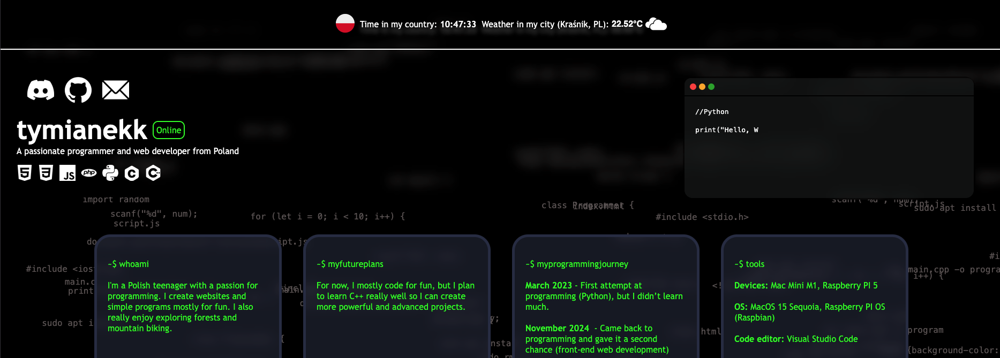

# tymianekk.dev

---

---

## About

This is the source code of my personal website – [tymianekk.dev](https://tymianekk.dev).  
It's a simple website where I share a bit about myself and my interests.  
The site is built with basic front-end technologies and is constantly evolving as I learn and improve.

---

## Tech Stack

  
  
  
  
  

---

